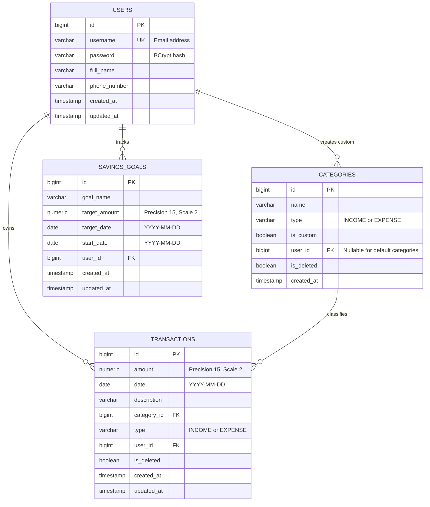

# Personal Finance Manager

A robust, production-grade RESTful backend application for managing personal finances, tracking income and expense transactions, organizing customizable categories, tracking savings goals dynamically, and generating detailed financial reports.

Built as an end-to-end technical assessment for the **Syfe Backend Intern** role.

---

## Table of Contents
- [Overview](#overview)
- [Features](#features)
- [Architecture](#architecture)
- [Tech Stack](#tech-stack)
- [Database Schema](#database-schema)
- [Authentication & Session Flow](#authentication--session-flow)
- [API Documentation](#api-documentation)
- [Validation Rules](#validation-rules)
- [Error Handling](#error-handling)
- [Running Locally](#running-locally)
- [Environment Variables](#environment-variables)
- [Testing & JaCoCo Coverage](#testing--jacoco-coverage)
- [Render Deployment Guide](#render-deployment-guide)
- [Design Decisions](#design-decisions)
- [API Test Collection](#api-test-collection)

---

## Overview

The Personal Finance Manager backend provides secure, multi-tenant financial tracking for individuals. Designed with clean layered architecture, strict data isolation, defensive error handling, and high test coverage (**94.99% instruction coverage across 76 automated tests**), it strictly adheres to the Syfe technical specification.

---

## Features

1. **Session-Based Authentication (No JWT)**:
   - State-of-the-art session management utilizing secure HTTP cookies (`JSESSIONID`).
   - Secure registration with BCrypt password hashing and user conflict checks.
   - Session invalidation upon logout.
2. **Transaction Management**:
   - Full CRUD operations on income and expense transactions.
   - Transaction type (`INCOME` or `EXPENSE`) is automatically inferred from the selected category to ensure transactional integrity.
   - Date immutability (transaction dates cannot be altered after creation).
   - Composable filtering by `startDate`, `endDate`, `categoryId`, and transaction `type`.
   - Results sorted by newest date first (`date DESC, id DESC`).
   - Soft-delete pattern ensuring deleted transactions are omitted from calculations and reports.
3. **Category Management**:
   - Pre-seeded default system categories: `Salary` (Income), `Food`, `Rent`, `Transportation`, `Entertainment`, `Healthcare`, `Utilities` (Expense).
   - Users can create custom categories (`INCOME` or `EXPENSE`) unique to their account.
   - Default categories are protected against modification and deletion (403 Forbidden).
   - Categories referenced by active transactions cannot be deleted (400 Bad Request).
4. **Savings Goals & Dynamic Progress**:
   - Goal creation with target amount, future target date, and optional start date (defaults to today).
   - Dynamic real-time calculation:
     $$\text{currentProgress} = \sum \text{Income} - \sum \text{Expenses (since startDate)}$$
     $$\text{progressPercentage} = \left(\frac{\text{currentProgress}}{\text{targetAmount}}\right) \times 100$$
     $$\text{remainingAmount} = \max(0, \text{targetAmount} - \text{currentProgress})$$
   - Independent goal calculations preventing division by zero and handling overachievement gracefully.
5. **Aggregated Financial Reporting**:
   - Monthly and yearly breakdown of total income grouped by category, total expenses grouped by category, and `netSavings`.
   - Complete exclusion of soft-deleted records.
6. **Strict Multi-Tenant Data Isolation**:
   - All protected resources determine the user identity exclusively from the authenticated HTTP session.
   - Users can never view, update, or delete other users' records (returning 404 Not Found without leaking existence).
7. **Production & Cloud Readiness**:
   - Native support for PostgreSQL in production and H2 in-memory DB for automated testing.
   - Configurable for cloud providers such as Render via standard environment variables (`PORT`, `DATABASE_URL`, `DB_USERNAME`, `DB_PASSWORD`).
   - OpenAPI / Swagger documentation and `/api/health` probe.

---

## Architecture

The project strictly follows standard enterprise Spring Boot layered architecture:

```
                      Client (Browser / Postman / cURL)
                                     │
                     [ HTTP Cookie: JSESSIONID ]
                                     ▼
                    ┌─────────────────────────────────┐
                    │       Security Filter Chain     │
                    │   (Session Auth & Auth Guards)  │
                    └────────────────┬────────────────┘
                                     │
                                     ▼
                          Controller Layer (REST)
                        com.syfe.finance.controller
                 (Request/Response DTO mapping & validation)
                                     │
                                     ▼
                           Service Layer (Domain)
                          com.syfe.finance.service
                       (Business rules, calculations,
                          aggregations, isolation)
                                     │
                                     ▼
                          Repository Layer (JPA)
                        com.syfe.finance.repository
                       (Persistence queries & specs)
                                     │
                                     ▼
                        Relational Database Engine
                          (PostgreSQL / H2 Test)
```

### Package Structure
```
com.syfe.finance
├── config          # Security, OpenAPI, and Startup Category Initializer
├── controller      # REST Controllers (Auth, Transaction, Category, Goal, Report, Health)
├── dto             # Data Transfer Objects separated by domain
│   ├── auth
│   ├── category
│   ├── common
│   ├── goal
│   ├── report
│   └── transaction
├── entity          # JPA Entities (User, Category, Transaction, SavingsGoal, CategoryType)
├── exception       # GlobalExceptionHandler and custom Domain Exceptions
├── repository      # Spring Data JPA Repositories
├── security        # UserDetails, UserDetailsService, SecurityUtils, Auth Handlers
└── service         # Business Services (Auth, Transaction, Category, SavingsGoal, Report)
```

---

## Tech Stack

- **Java**: 17 (Eclipse Temurin)
- **Framework**: Spring Boot 3.2.5
- **Build Tool**: Apache Maven 3.9.6 (with Maven Wrapper `mvnw`)
- **Security**: Spring Security 6 (Session-based authentication, BCrypt)
- **Persistence**: Spring Data JPA, Hibernate 6
- **Database**:
  - PostgreSQL (Production / Cloud)
  - H2 Database (Unit and Integration testing)
- **Validation**: Jakarta Bean Validation (Hibernate Validator)
- **Code Generation**: Project Lombok (with `lombok.config` to ignore generated code from JaCoCo)
- **Testing**: JUnit 5, Mockito, Spring Boot Test, Spring Security Test
- **Code Coverage**: JaCoCo Maven Plugin (minimum 80% rule enforced, achieved **94.99%**)
- **API Docs**: SpringDoc OpenAPI 2.3.0 (Swagger UI)

---

## Database Schema



### Table Details
1. **`users`**:
   - `id`: Auto-increment primary key.
   - `username`: Email address, unique constraint (`uq_users_username`).
   - `password`: BCrypt hashed string.
2. **`categories`**:
   - Default categories have `is_custom = false` and `user_id = NULL`.
   - Custom categories have `is_custom = true` and `user_id = <authenticated_user_id>`.
   - Unique constraint across `(user_id, name)` prevents duplicate custom categories per user.
3. **`transactions`**:
   - `amount`: `BigDecimal` (numeric 15, 2) storing exact currency values.
   - `type`: Enforced to match `category.type`.
   - Indexed on `(user_id, date)` and `(user_id, category_id)` for high-performance filtering.
4. **`savings_goals`**:
   - `start_date`: Defaults to goal creation date if not supplied.
   - Indexed on `user_id`.

---

## Authentication & Session Flow

The specification strictly mandates **Session-Based Authentication** with no JWTs.

1. **Registration (`POST /api/auth/register`)**:
   - Validates email, password complexity (min 8 chars, letters and digits), and phone number.
   - Hashes password using `BCryptPasswordEncoder`.
   - Returns `201 Created` with the new user's ID.
2. **Login (`POST /api/auth/login`)**:
   - Authenticates credentials via Spring Security `AuthenticationManager`.
   - Creates a new `SecurityContext` containing `CustomUserDetails`.
   - Stores the context into `HttpSessionSecurityContextRepository`.
   - Returns `Set-Cookie: JSESSIONID=...; Path=/; HttpOnly; SameSite=Lax`.
3. **Authenticated Requests**:
   - Client sends the session cookie: `Cookie: JSESSIONID=...`.
   - Spring Security resolves the session and sets the `SecurityContext`.
   - `SecurityUtils.getCurrentUser()` extracts the authenticated user entity.
4. **Logout (`POST /api/auth/logout`)**:
   - Invalidates the active HTTP session (`session.invalidate()`).
   - Clears `SecurityContextHolder`.

---

## API Documentation

Base URL: `http://localhost:8080/api` (or your Render domain)
Interactive Swagger UI: `http://localhost:8080/swagger-ui.html`

### 1. Health
- **`GET /api/health`**
  - **Auth**: None (Public)
  - **Response (200 OK)**:
    ```json
    { "status": "UP" }
    ```

---

### 2. Authentication
- **`POST /api/auth/register`**
  - **Auth**: None (Public)
  - **Request Body**:
    ```json
    {
      "username": "user@example.com",
      "password": "password123",
      "fullName": "John Doe",
      "phoneNumber": "+1234567890"
    }
    ```
  - **Response (201 Created)**:
    ```json
    {
      "message": "User registered successfully",
      "userId": 1
    }
    ```
  - **Status Codes**: `201 Created`, `400 Bad Request`, `409 Conflict`.

- **`POST /api/auth/login`**
  - **Auth**: None (Public)
  - **Request Body**:
    ```json
    {
      "username": "user@example.com",
      "password": "password123"
    }
    ```
  - **Response (200 OK)**:
    ```json
    {
      "message": "Login successful"
    }
    ```
  - **Status Codes**: `200 OK`, `400 Bad Request`, `401 Unauthorized`.

- **`POST /api/auth/logout`**
  - **Auth**: Session required
  - **Response (200 OK)**:
    ```json
    {
      "message": "Logout successful"
    }
    ```
  - **Status Codes**: `200 OK`, `401 Unauthorized`.

---

### 3. Categories
- **`GET /api/categories`**
  - **Auth**: Session required
  - **Response (200 OK)**:
    ```json
    {
      "categories": [
        { "name": "Salary", "type": "INCOME", "isCustom": false },
        { "name": "Food", "type": "EXPENSE", "isCustom": false },
        { "name": "Rent", "type": "EXPENSE", "isCustom": false },
        { "name": "Transportation", "type": "EXPENSE", "isCustom": false },
        { "name": "Entertainment", "type": "EXPENSE", "isCustom": false },
        { "name": "Healthcare", "type": "EXPENSE", "isCustom": false },
        { "name": "Utilities", "type": "EXPENSE", "isCustom": false },
        { "name": "SideBusinessIncome", "type": "INCOME", "isCustom": true }
      ]
    }
    ```

- **`POST /api/categories`**
  - **Auth**: Session required
  - **Request Body**:
    ```json
    {
      "name": "SideBusinessIncome",
      "type": "INCOME"
    }
    ```
  - **Response (201 Created)**:
    ```json
    {
      "name": "SideBusinessIncome",
      "type": "INCOME",
      "isCustom": true
    }
    ```
  - **Status Codes**: `201 Created`, `400 Bad Request`, `401 Unauthorized`, `409 Conflict`.

- **`DELETE /api/categories/{name}`**
  - **Auth**: Session required
  - **Response (200 OK)**:
    ```json
    {
      "message": "Category deleted successfully"
    }
    ```
  - **Status Codes**: `200 OK`, `400 Bad Request` (if in use), `401 Unauthorized`, `403 Forbidden` (if default category), `404 Not Found`.

---

### 4. Transactions
- **`POST /api/transactions`**
  - **Auth**: Session required
  - **Request Body**:
    ```json
    {
      "amount": 50000.00,
      "date": "2024-01-15",
      "category": "Salary",
      "description": "January Salary"
    }
    ```
  - **Response (201 Created)**:
    ```json
    {
      "id": 1,
      "amount": 50000.00,
      "date": "2024-01-15",
      "category": "Salary",
      "description": "January Salary",
      "type": "INCOME"
    }
    ```
  - **Status Codes**: `201 Created`, `400 Bad Request`, `401 Unauthorized`.

- **`GET /api/transactions`**
  - **Auth**: Session required
  - **Query Parameters (Optional & Composable)**:
    - `startDate`: `YYYY-MM-DD`
    - `endDate`: `YYYY-MM-DD`
    - `categoryId`: Long
    - `type`: `INCOME` or `EXPENSE`
  - **Response (200 OK)**:
    ```json
    {
      "transactions": [
        {
          "id": 1,
          "amount": 50000.00,
          "date": "2024-01-15",
          "category": "Salary",
          "description": "January Salary",
          "type": "INCOME"
        }
      ]
    }
    ```

- **`PUT /api/transactions/{id}`**
  - **Auth**: Session required
  - **Request Body**:
    ```json
    {
      "amount": 60000.00,
      "description": "Updated January Salary"
    }
    ```
  - **Note**: The `date` field cannot be modified. If a different date is submitted, a `400 Bad Request` is returned.
  - **Response (200 OK)**:
    ```json
    {
      "id": 1,
      "amount": 60000.00,
      "date": "2024-01-15",
      "category": "Salary",
      "description": "Updated January Salary",
      "type": "INCOME"
    }
    ```
  - **Status Codes**: `200 OK`, `400 Bad Request`, `401 Unauthorized`, `404 Not Found`.

- **`DELETE /api/transactions/{id}`**
  - **Auth**: Session required
  - **Response (200 OK)**:
    ```json
    {
      "message": "Transaction deleted successfully"
    }
    ```
  - **Status Codes**: `200 OK`, `401 Unauthorized`, `404 Not Found`.

---

### 5. Savings Goals
- **`POST /api/goals`**
  - **Auth**: Session required
  - **Request Body**:
    ```json
    {
      "goalName": "Emergency Fund",
      "targetAmount": 5000.00,
      "targetDate": "2026-01-01",
      "startDate": "2025-01-01"
    }
    ```
  - **Response (201 Created)**:
    ```json
    {
      "id": 1,
      "goalName": "Emergency Fund",
      "targetAmount": 5000.00,
      "targetDate": "2026-01-01",
      "startDate": "2025-01-01",
      "currentProgress": 1000.00,
      "progressPercentage": 20.0,
      "remainingAmount": 4000.00
    }
    ```
  - **Status Codes**: `201 Created`, `400 Bad Request`, `401 Unauthorized`.

- **`GET /api/goals`**
  - **Auth**: Session required
  - **Response (200 OK)**:
    ```json
    {
      "goals": [
        {
          "id": 1,
          "goalName": "Emergency Fund",
          "targetAmount": 5000.00,
          "targetDate": "2026-01-01",
          "startDate": "2025-01-01",
          "currentProgress": 1000.00,
          "progressPercentage": 20.0,
          "remainingAmount": 4000.00
        }
      ]
    }
    ```

- **`GET /api/goals/{id}`**
  - **Auth**: Session required
  - **Response (200 OK)**: Returns the single goal structure.
  - **Status Codes**: `200 OK`, `401 Unauthorized`, `404 Not Found`.

- **`PUT /api/goals/{id}`**
  - **Auth**: Session required
  - **Request Body**:
    ```json
    {
      "targetAmount": 6000.00,
      "targetDate": "2026-02-01"
    }
    ```
  - **Response (200 OK)**:
    ```json
    {
      "id": 1,
      "goalName": "Emergency Fund",
      "targetAmount": 6000.00,
      "targetDate": "2026-02-01",
      "startDate": "2025-01-01",
      "currentProgress": 1000.00,
      "progressPercentage": 16.67,
      "remainingAmount": 5000.00
    }
    ```

- **`DELETE /api/goals/{id}`**
  - **Auth**: Session required
  - **Response (200 OK)**:
    ```json
    {
      "message": "Goal deleted successfully"
    }
    ```

---

### 6. Reports
- **`GET /api/reports/monthly/{year}/{month}`**
  - **Auth**: Session required
  - **Example**: `GET /api/reports/monthly/2024/1`
  - **Response (200 OK)**:
    ```json
    {
      "month": 1,
      "year": 2024,
      "totalIncome": {
        "Salary": 3000.00,
        "Freelance": 500.00
      },
      "totalExpenses": {
        "Food": 400.00,
        "Rent": 1200.00,
        "Transportation": 200.00
      },
      "netSavings": 1700.00
    }
    ```

- **`GET /api/reports/yearly/{year}`**
  - **Auth**: Session required
  - **Example**: `GET /api/reports/yearly/2024`
  - **Response (200 OK)**:
    ```json
    {
      "year": 2024,
      "totalIncome": {
        "Salary": 36000.00,
        "Freelance": 6000.00
      },
      "totalExpenses": {
        "Food": 4800.00,
        "Rent": 14400.00,
        "Transportation": 2400.00
      },
      "netSavings": 20400.00
    }
    ```

---

## Validation Rules

Jakarta Bean Validation is applied across all DTOs:

| Domain | Field | Validation Rules | Error Code |
|---|---|---|---|
| Auth | `username` | `@NotBlank`, `@Email`, unique in database | 400 / 409 |
| Auth | `password` | `@NotBlank`, `@Size(min = 8, max = 100)`, must have letter & number | 400 |
| Auth | `fullName` | `@NotBlank`, `@Size(min = 2, max = 100)` | 400 |
| Auth | `phoneNumber` | `@NotBlank`, regex `^\+?[0-9]{7,15}$` | 400 |
| Category | `name` | `@NotBlank`, `@Size(min = 2, max = 50)`, unique per user | 400 / 409 |
| Category | `type` | `@NotNull` (`INCOME` or `EXPENSE`) | 400 |
| Transaction | `amount` | `@NotNull`, `@Positive`, `BigDecimal` scale 2 | 400 |
| Transaction | `date` | `@NotNull`, `@PastOrPresent` (no future dates), `YYYY-MM-DD` | 400 |
| Transaction | `category` | `@NotBlank`, must exist and be accessible to user | 400 |
| Goal | `goalName` | `@NotBlank`, `@Size(min = 2, max = 100)` | 400 |
| Goal | `targetAmount` | `@NotNull`, `@Positive`, `BigDecimal` scale 2 | 400 |
| Goal | `targetDate` | `@NotNull`, `@Future`, must be after `startDate` | 400 |
| Report | `month` | Integer between 1 and 12 | 400 |
| Report | `year` | Integer between 1900 and 2100 | 400 |

---

## Error Handling

Centralized `@RestControllerAdvice` in `GlobalExceptionHandler` formats all errors consistently without exposing internal stack traces:

```json
{
  "timestamp": "2024-01-15T10:00:00.000",
  "status": 400,
  "error": "Bad Request",
  "message": "Amount must be positive",
  "path": "/api/transactions",
  "details": ["Amount must be positive"]
}
```

### Handled Status Codes
- **400 Bad Request**: Input validation failures, malformed JSON, date parsing issues, attempting to modify immutable transaction date, attempting to delete a category referenced by active transactions.
- **401 Unauthorized**: Missing session cookie, expired session, invalid login credentials.
- **403 Forbidden**: Accessing forbidden operations (e.g. attempting to delete a default category).
- **404 Not Found**: Resource does not exist or belongs to another user.
- **409 Conflict**: Duplicate username registration or duplicate custom category name.

---

## Running Locally

### Prerequisites
- **Java 17+**
- **Git**

### Step-by-Step

1. **Clone the repository**:
   ```bash
   git clone <repository-url>
   cd "syfe_finance manager"
   ```

2. **Run Tests & Verify Coverage**:
   ```bash
   # On Linux/macOS
   ./mvnw clean test jacoco:report

   # On Windows
   .\mvnw.cmd clean test jacoco:report
   ```

3. **Start Application Locally**:
   By default, the application runs on port `8080`. For local evaluation without an external PostgreSQL instance, specify the `test` profile (which activates in-memory H2 with PostgreSQL compatibility mode):
   ```bash
   # Linux/macOS
   ./mvnw spring-boot:run -Dspring-boot.run.profiles=test

   # Windows PowerShell
   .\mvnw.cmd spring-boot:run -Dspring-boot.run.profiles=test
   ```

4. **Verify Application Health**:
   ```bash
   curl http://localhost:8080/api/health
   ```
   Output: `{"status":"UP"}`

5. **Access Interactive API Docs**:
   Navigate to: `http://localhost:8080/swagger-ui.html`

---

## Environment Variables

When running in production (e.g. on Render or Docker), configure:

| Variable | Description | Default | Example |
|---|---|---|---|
| `PORT` | HTTP Server port | `8080` | `8080` |
| `DATABASE_URL` | PostgreSQL connection URL | `jdbc:postgresql://localhost:5432/financedb` | `jdbc:postgresql://postgres.render.com:5432/syfe_db` |
| `DB_USERNAME` | Database username | `postgres` | `syfe_admin` |
| `DB_PASSWORD` | Database password | `postgres` | `secret_password` |
| `COOKIE_SECURE` | Enforce HTTPS-only cookie | `false` | `true` |
| `SWAGGER_ENABLED` | Enable OpenAPI Swagger docs | `true` | `true` |

---

## Testing & JaCoCo Coverage

### Running Tests
Execute:
```bash
.\mvnw.cmd test jacoco:report
```

### Coverage Results
- **Overall Instruction Coverage**: **94.99%**
- **Service Layer Coverage**: **93.82%**
- **Controller Layer Coverage**: **94.76%**
- **Total Test Count**: **76 automated tests** (76 Passed, 0 Failures, 0 Errors, 0 Skipped)

The HTML coverage report can be viewed at:
`target/site/jacoco/index.html`

### Test Suite Breakdown
1. **`AuthServiceTest` & `AuthControllerTest`**:
   - Successful registration and duplicate email conflict (409).
   - Validations on weak password and bad email.
   - Session lifecycle: login -> authenticated access -> logout -> 401 unauthorized.
2. **`CategoryServiceTest` & `CategoryControllerTest`**:
   - Default category seeding.
   - Custom category creation and duplicate prevention.
   - Default category deletion guard (403 Forbidden).
   - In-use category deletion guard (400 Bad Request).
   - Soft-deletion of unused custom categories.
3. **`TransactionServiceTest` & `TransactionControllerTest`**:
   - Income & expense creation with automatic type derivation.
   - Rejection of future dates and non-positive amounts.
   - Sorting by newest date first.
   - Composable multi-parameter filtering (`startDate`, `endDate`, `categoryId`, `type`).
   - Immutable date enforcement on update (400 Bad Request).
   - Soft deletion and exclusion from subsequent queries.
4. **`SavingsGoalServiceTest` & `SavingsGoalControllerTest`**:
   - Creation with default and custom start dates.
   - Dynamic formula calculation of progress, progress percentage, and remaining amount.
   - Safe division by zero prevention.
   - Handling of overachieved goals.
   - Full CRUD lifecycle.
5. **`ReportServiceTest` & `ReportControllerTest`**:
   - Monthly category grouping for income and expenses with net savings.
   - Yearly aggregation.
   - Zero amounts for empty periods.
   - Month and year range validations (1-12, 1900-2100).
6. **`DataIsolationIntegrationTest`**:
   - User B cannot see User A's transactions in lists.
   - User B receives 404 when attempting to view, update, or delete User A's transactions.
   - User B receives 404 when attempting to view, update, or delete User A's goals.
   - User B receives 404 when attempting to delete User A's custom category.
   - User B's monthly reports do not include User A's financial transactions.

---

## Render Deployment Guide

Deploying this project to Render is fully supported:

1. **Push to GitHub**:
   Push the project repository to GitHub.

2. **Create a PostgreSQL Database on Render**:
   - Log in to [Render Dashboard](https://dashboard.render.com).
   - Click **New** -> **PostgreSQL**.
   - Note the **Internal Database URL**, **User**, and **Password**.

3. **Create a Web Service on Render**:
   - Click **New** -> **Web Service**.
   - Connect your GitHub repository.
   - Choose **Environment**: `Java` (or `Docker`).
   - **Build Command**:
     ```bash
     ./mvnw clean package -DskipTests
     ```
   - **Start Command**:
     ```bash
     java -jar target/finance-manager-1.0.0.jar
     ```

4. **Add Environment Variables**:
   In the Render Web Service **Environment** tab:
   - `DATABASE_URL`: `jdbc:postgresql://<host>:5432/<dbname>`
   - `DB_USERNAME`: `<db_user>`
   - `DB_PASSWORD`: `<db_password>`
   - `COOKIE_SECURE`: `true`
   - `PORT`: `10000` (Render will automatically assign `PORT`)

5. **Deploy**:
   Render will automatically build the JAR and launch the backend application.

---

## Design Decisions

1. **Why Session-Based Authentication instead of JWT?**
   The Syfe technical specification explicitly mandates session-based authentication using cookies. Session authentication allows instantaneous server-side revocation on logout (`session.invalidate()`), prevents token theft via `HttpOnly` cookie protection, and aligns with standard banking backend security standards.
2. **Why `BigDecimal` for Money?**
   Binary floating-point types (`double`, `float`) introduce binary rounding inaccuracies (e.g. `0.1 + 0.2 = 0.30000000000000004`). In financial software, every cent must balance precisely. All amounts, calculations, and balances use `BigDecimal` with scale 2 and `RoundingMode.HALF_UP`.
3. **Why Separate DTOs from JPA Entities?**
   Exposing JPA entities in REST controllers causes security vulnerabilities (mass assignment), cyclic serialization issues, and couples internal persistence schemas with external API contracts. DTOs isolate API payloads and enable strict input validation.
4. **Why Soft-Delete for Transactions and Categories?**
   Financial systems maintain audit trails. Deleting a row physically destroys transaction history and causes foreign key reference problems. Setting `isDeleted = true` preserves referential integrity while all business calculations, reports, and goal progress queries explicitly filter by `isDeleted = false`.
5. **How Data Isolation is Enforced**:
   Client-supplied `userId` parameters are never trusted. The current user is resolved exclusively from the authenticated HTTP session (`SecurityContextHolder`). Every database query predicates on `user = :currentUser`, ensuring zero data leakage across tenants.

---

## API Test Collection

A complete **Postman Collection** is included in the project root:
[`postman_collection.json`](./postman_collection.json)

It contains all 22 end-to-end evaluation requests covering:
1. Health check
2. User A registration
3. User A login (cookie captured)
4. Retrieve default categories
5. Create custom category
6. Create income transaction
7. Create expense transaction
8. Create transaction with custom category
9. Get transactions (sorted newest first)
10. Filter transactions (date range and type)
11. Update transaction
12. Create savings goal
13. Get all savings goals
14. Update savings goal
15. Monthly report
16. Yearly report
17. Delete transaction
18. Delete custom category
19. Logout User A
20. Verify 401 on protected endpoint
21. User B registration
22. User B verify cross-user isolation (404 on User A's data)

Import `postman_collection.json` into Postman, set the `baseUrl` variable to `http://localhost:8080`, and execute the collection in sequence.
